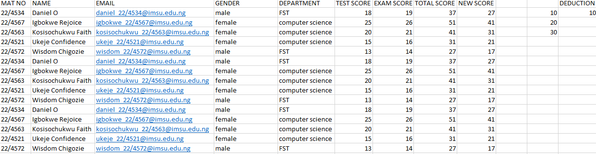

# Students-Exam-Records
Collecting students exam records and using Flash fill to generate their emails,using cell referencing to get their total scores and making a cell address fixed on a particular cell(deduce) to get their new score, which is a deduction of 10 from everyone

